<div align="center">

# ⬡ Token Visualizer

### Live tokens, cost, and sessions for **Claude Code**, **Codex CLI**, and **DeepSeek** — in real time.

[](#-tech-stack)
[](#-tech-stack)
[](#-tech-stack)
[](#-quick-start)


<br />

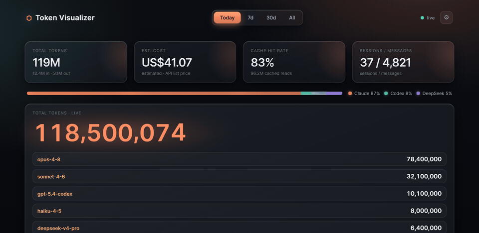

</div>

> [!NOTE]
> Every screenshot and screen recording in this README is rendered from **mock demo data** — no API keys, no real prompts, no usage from any real account.

---

## ✨ What it is

**Token Visualizer** is a real-time token-usage and cost dashboard for **Claude Code**, **Codex CLI**, and **DeepSeek** (via reasonix). It reads local usage logs, imports them into SQLite, and renders live totals, sessions, charts, and rate-limit gauges in a **Tauri desktop app** or **any browser**. It is strictly **read-only**: your source logs stay untouched and all data stays on your machine.

## 🎯 Highlights

- 🎰 **Token odometer** — watch your running token total tick upward in real time.
- 🧩 **Multi-source view** — combine Claude, Codex, and DeepSeek usage in one dashboard.
- 💬 **Live sessions** — see active sessions, last user messages, model, state, and freshness.
- 📊 **Usage charts** — split usage by source, by model, and over time without flicker.
- ⏱️ **Limit gauges** — track Codex 5-hour and weekly limits with the time remaining.
- 💱 **Currency switching** — view estimated cost in USD, CNY, HKD, EUR, JPY, or GBP.
- 🖥️ **Desktop surfaces** — a full dashboard window **plus** a tray "Today" popover.
- 🌐 **Browser mode** — run the same frontend cross-platform with `npm run serve`.

---

## 🧩 Features

### 🎰 Rolling token odometer

A continuous slot-machine-reel odometer keeps your running token total visible at a glance — the units reel rolls continuously during active use instead of snapping and freezing. KPI cards beside it summarize cost, cache-hit rate, messages, and sessions for the selected range.

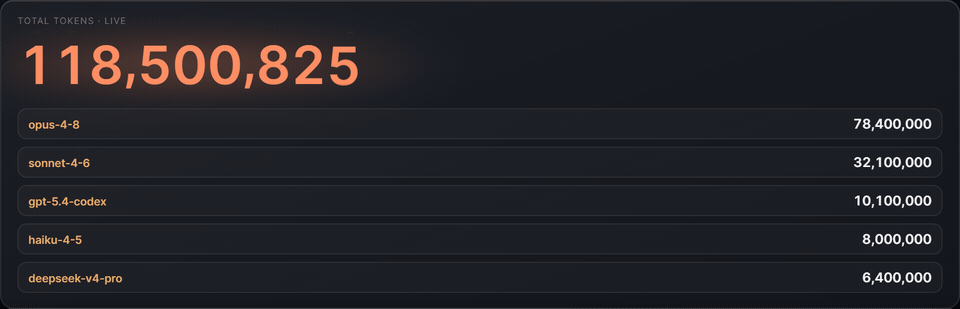

### 🧩 Unified source breakdown

Token Visualizer merges **Claude Code + Codex CLI + DeepSeek** usage into one local view. A by-source split bar shows exactly how your tokens are distributed across tools, with a per-source color accent carried throughout the UI.

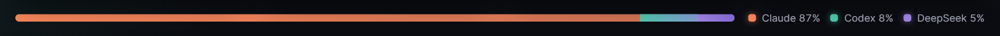

### 💬 Live session strip

Each active session gets its own row with a **source icon**, the **last user message** for that session, model, token count, a **state badge** (idle · thinking · working·_tool_ · responding · waiting · sleeping), and a live "_Nm ago_" freshness label. Server-sent events keep the strip current without a manual refresh.

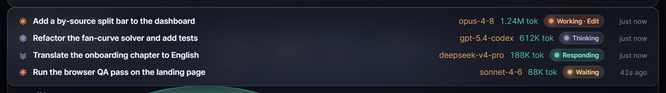

### 📊 Charts that morph in place

A **by-model donut**, a **top-projects** bar chart, and a stacked **token-usage-over-time** chart. Switching between **Today / 7d / 30d / All** tweens the numbers and morphs the charts in place — no flash, no reflow, no flicker.

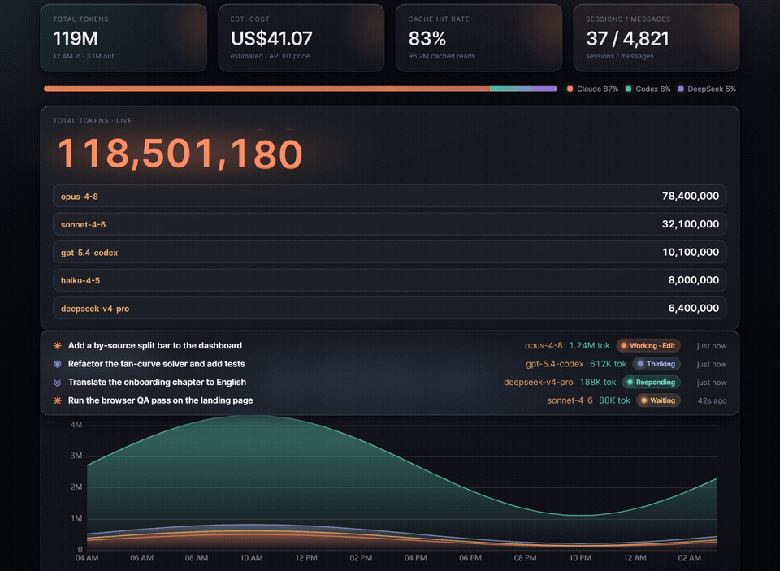

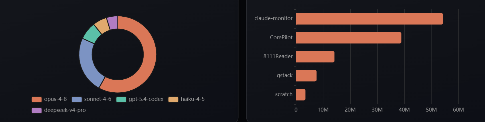

### ⏱️ Session limits & currency

Codex **5-hour** and **Weekly** rate-limit gauges show used %, remaining %, and a live reset countdown, alongside per-session token meters. Cost estimates can be displayed in **USD, CNY, HKD, EUR, JPY, or GBP**.

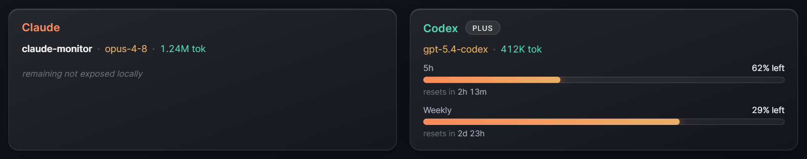

### 🖥️ Tray popover + dashboard window

The **Tauri desktop app** gives you both a full dashboard window and a compact system-tray **"Today"** popover. Use the popover for a quick glance and the dashboard when you want the whole picture — plus session-end notifications.

### 🌐 The same app, in any browser

**Browser mode** serves the identical frontend with a single command. It is the same bundle and the same local server, so every animation behaves the same — handy on macOS/Linux, on a remote machine, or anywhere you want the dashboard without launching the desktop shell.

```bash
npm run serve   # builds if needed, then opens your default browser
```

---

## 🚀 Quick start

Build from source (needs **Node 20+** and **Rust** stable — with the MSVC toolchain on Windows):

```bash
# 1. install frontend deps
npm install

# 2a. desktop app (Tauri) — produces an installer under src-tauri/target/release/bundle/
npx tauri build

# 2b. …or just run the dashboard in your browser (cross-platform)
npm run serve
```

> On Windows the desktop app needs the **WebView2 runtime** (bundled with Windows 11; otherwise `winget install Microsoft.EdgeWebView2Runtime`). Browser mode has no such requirement.

Handy environment overrides for browser mode: `CM_PORT` (default `8788`), `CM_DIST` (path to a prebuilt `dist/`), `CM_NO_OPEN=1` (don't auto-open a browser).

---

## 🏗️ How it works

Token Visualizer watches **read-only** usage logs from `~/.claude`, `~/.codex`, and `~/.reasonix`, parses them through a Rust core, and stores normalized usage in a local **SQLite** database (WAL mode). The shared `cmserver` crate wraps the core as `run_core(...)`, exposing an embedded **axum** server on `127.0.0.1` with REST queries and an **SSE** stream. Both front ends drive that exact same server path: the **Tauri desktop app** adds the tray, window, popover, and notifications, while the headless **`cm-serve`** binary runs the dashboard in browser mode. The server binds to `127.0.0.1` (never `localhost`) to dodge a system-proxy hazard that can hang loopback requests.

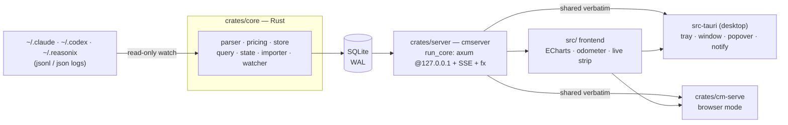

---

## 🧰 Tech stack

| Layer | Tech |
|---|---|
| **Core** | Rust · `tokio` · `notify` (log watchers) · custom parser/pricing/state |
| **Storage** | SQLite (`rusqlite`, WAL) |
| **Server** | `axum` on `127.0.0.1` · JSON REST · Server-Sent Events · daily FX rates |
| **Desktop** | Tauri 2 (tray + window + popover + notifications) · WebView2 |
| **Browser mode** | `cm-serve` binary — same `run_core`, opens your default browser |
| **Frontend** | TypeScript · Vite · ECharts · vanilla DOM (no framework) |

The core logic lives in a well-tested Rust crate (parser, pricing, query, and session-state are unit-tested); the frontend ships with a Vitest suite covering formatting, session-state mapping, the dashboard, the odometer, limits, and settings.

---

## 🔒 Privacy

Token Visualizer is **local-first and read-only**. It reads usage logs from Claude Code, Codex CLI, and reasonix, but **never writes to or modifies** those source directories. Imported data stays in your local SQLite database, and the embedded server only ever listens on `127.0.0.1`. Nothing is uploaded anywhere.

---

## 🖼️ Gallery

<div align="center">

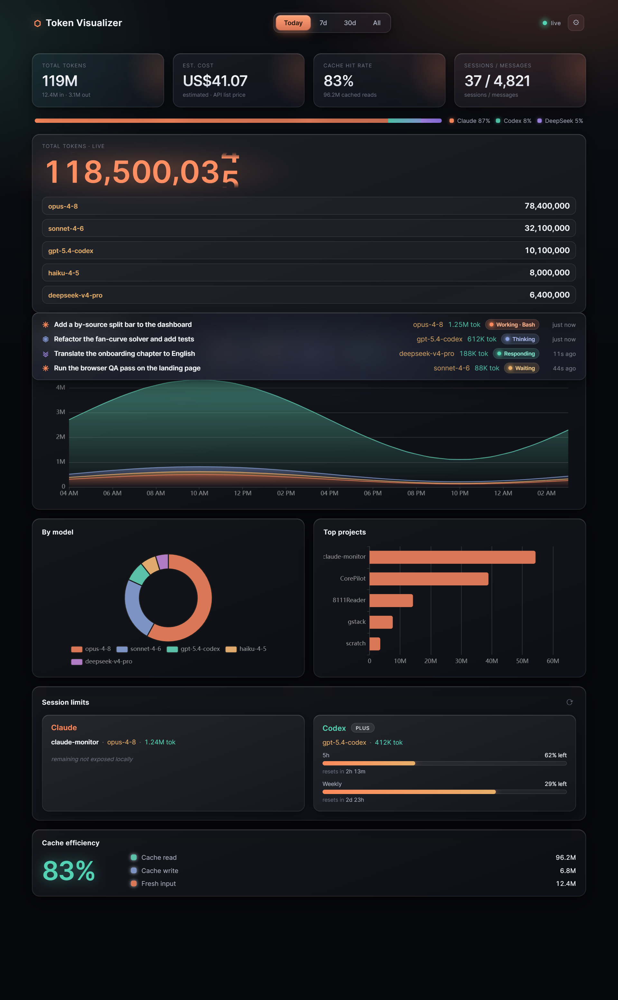

</div>

| Live sessions | Session limits |
|---|---|
| 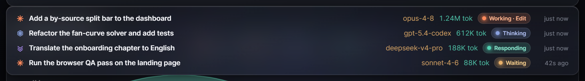 |  |

| By model & projects | Usage over time |
|---|---|
|  | 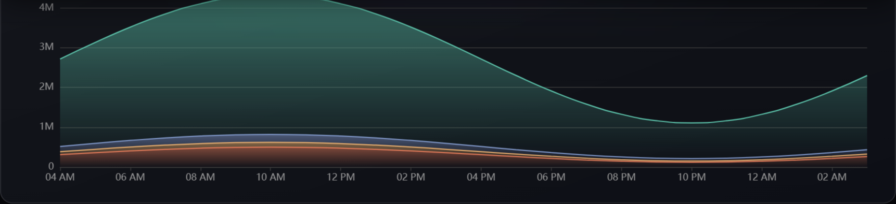 |

---

## 📦 Status & license

A personal, **unpublished** tool — not on any app store. Build it from source as above.

**License: TBD.** No license file is included yet; all rights reserved for now.

> The Clawd desktop-pet artwork references Anthropic's mascot/IP; this is a personal project and any redistribution would require Anthropic's permission.

---

<div align="center">
<sub>Built with Rust · Tauri 2 · TypeScript · ECharts — README screen recordings generated by <code>scripts/capture-readme.mjs</code> on mock demo data.</sub>
</div>
